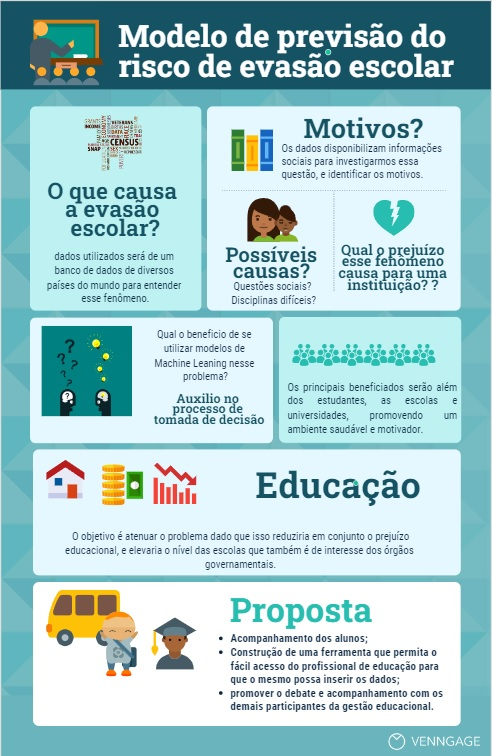

# Modelo de previsão do risco de evasão escolar 

O uso de técnicas de Machine Learning (ML) estão sendo empregadas de forma bastante diversas em diferentes áreas, como na saúde, economia, alimentação, meio ambiente e educação. O motivo do uso dessas técnicas de aprendizado de máquina é a possibilidade de reconhecer padrões que juntamente com o o aprendizado computacional da inteligencia artificial, possibilita a tomada de decisões a partir de algoritmos e dados disponiveis ao construir o algoritimo de aprendizado.

Considerando isto, a área da educação vem recebendo um reforço interessante com relação ao uso de técnicas de ML. Uma das aplicações mais enfatizadas é o estudo sobre evasão escolar, que vem sendo um dos pontos chaves para analisar a qualidade da educação de uma certa instituição. Surge assim, o questionamento "sobre de que maneira as técnicas de machine learning podem ser empregadas para mapear e identificar os tipos e os grupos de estudantes que sofrem ou sofrerão, um maior risco de evasão escolar?"

Compreende-se assim, que a questão da evasão escolar é uma problema presente em modos e níveis diferentes a depender da instituição, seja ela de ensino básico até o superior. No entanto é um assunto que vem sendo tratado em muitas pesquisas acadêmicas devido a sua associação com diversos outros problemas como a questão social que permeia aquele ambiente escolar ou academico. Comprender as causas da evasão escolar disponibiliza ao gestores educacionais ferramentas para trabalhar essa problemática afim de reduzir e viabiliar ações preventivas para amenizar esse efeito. Ações como palestras educativas, solicitações de verbas de auxilios estudantis e acompanhamento psicopedagogico. 

A proposta apresentada aqui, é da construção de um modelo de previsão de evasão escolar que permita o acompanhamento, e que seja também, usado como uma ferramenta que permita o fácil acesso a um profissional de educação para que o mesmo possa inserir os dados para posterior debate e acompanhamento com os demais participantes da gestão educacional. Serão utilizados dados de perfomance acadêmica contendo informações referentes a gênero, nacionalidade, nivel escolar e dentre outras informações pessoais do aluno como responsável e notas. O objetivo é atenuar o problema dado que isso reduziria em conjunto o prejuizo educacional, e elevaria o nivel das escolas que também é de interesse dos orgãos governamentais.

## Desenvolvedores

 - [Adilio Freitas](https://github.com/adiliojf)
 - [Aline Moreira](https://github.com/AlineDamas)
 - [Carlos Estellita](https://github.com/CarlosEstellita)
 - [Dália Chagas ](https://github.com/daliagomes-hub)
 - [Haendel Moreira](https://github.com/HaendelMoreira)
 - [Joshuel Nobre](https://github.com/JoshuelNobre)
 - [Stefane Adna](https://github.com/stefaneadna)
 - [Valdemi Junior](https://github.com/vjuniorr)